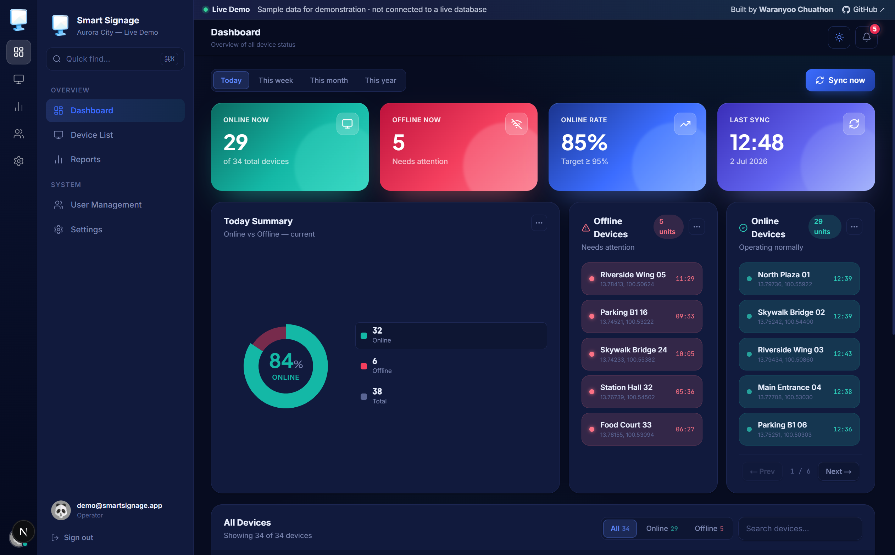
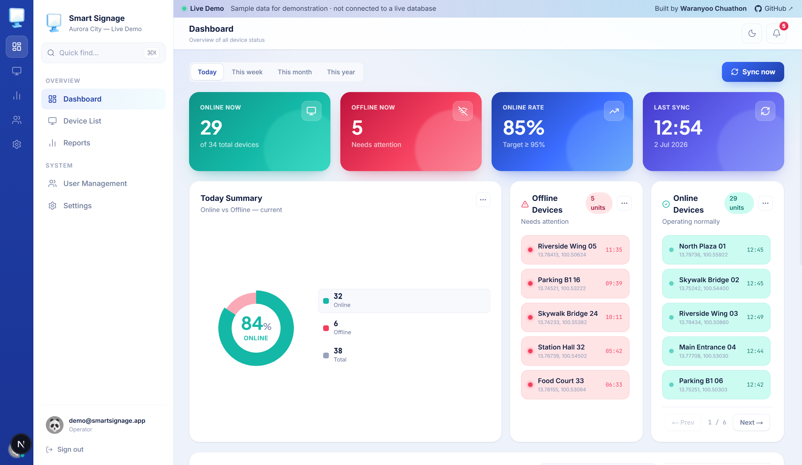
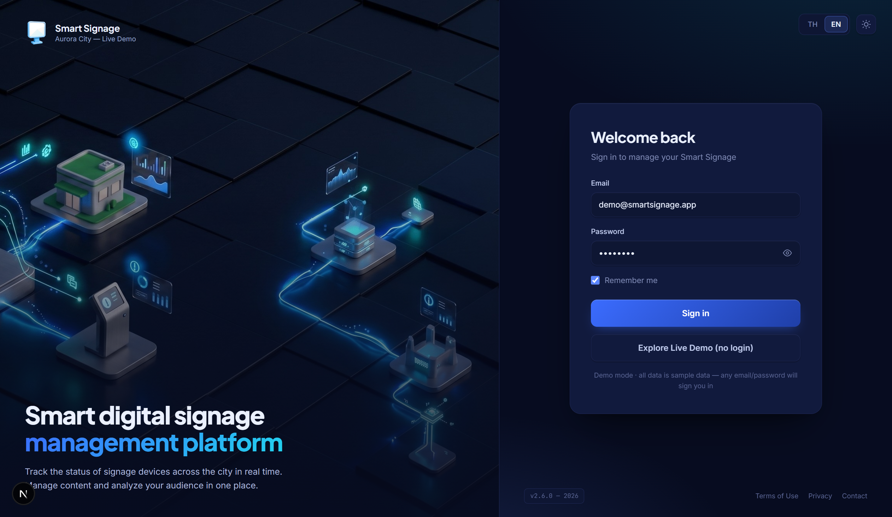
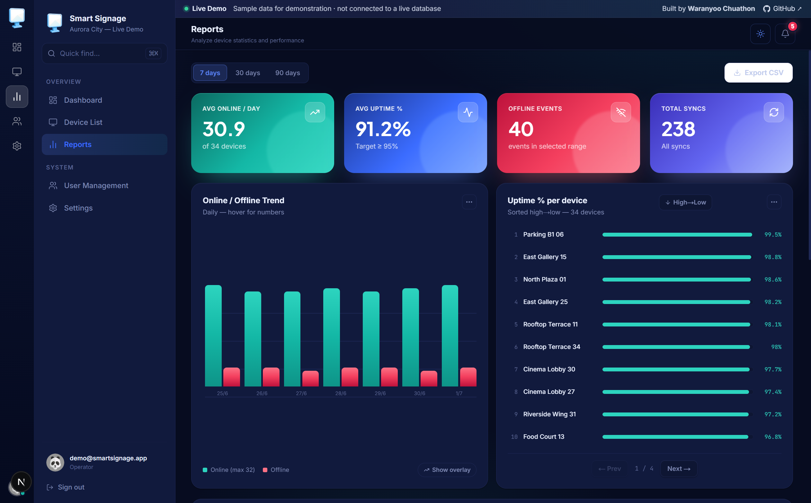
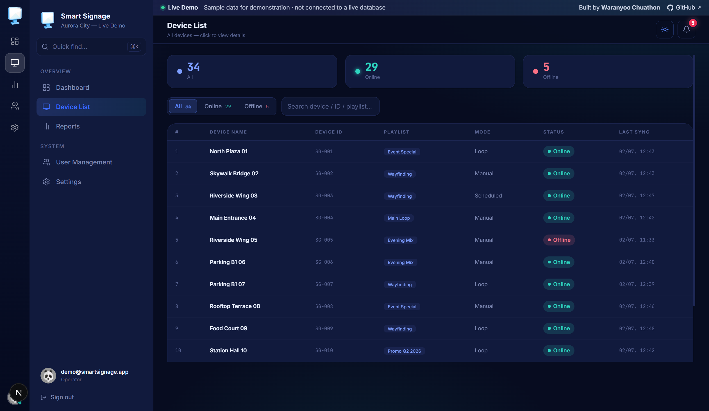
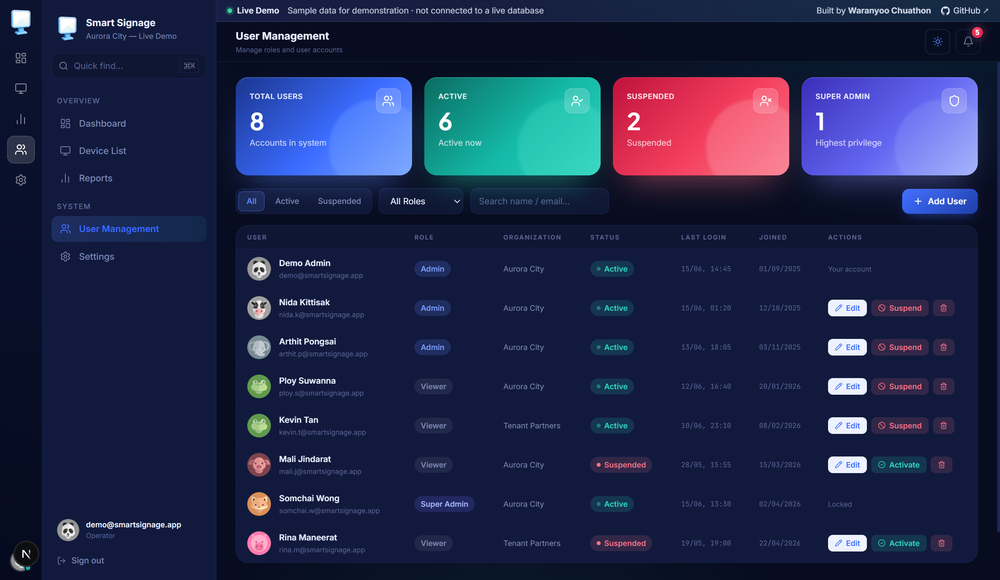
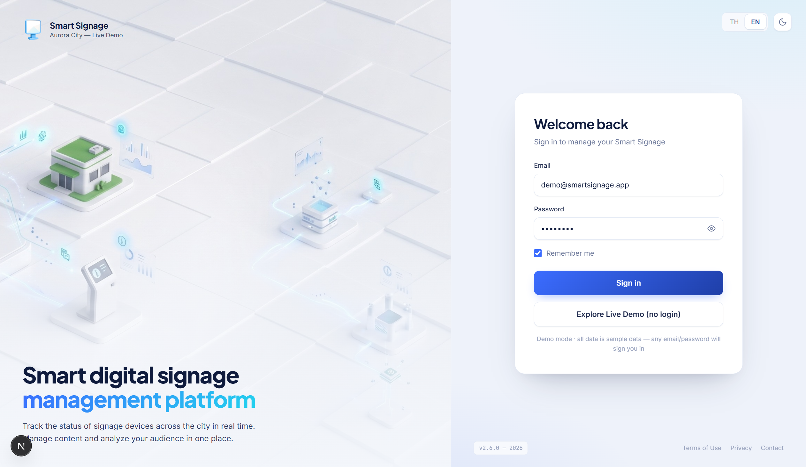
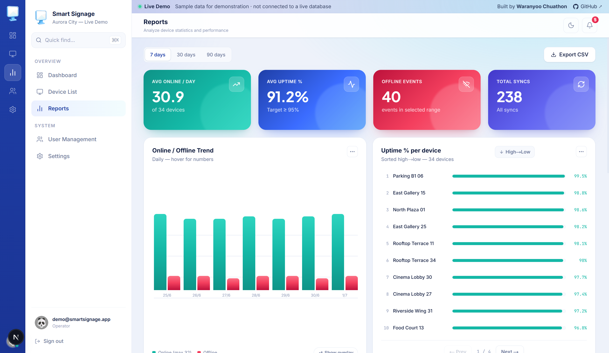
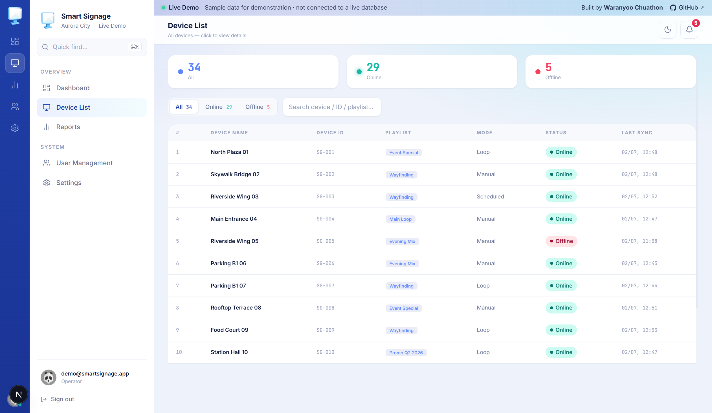
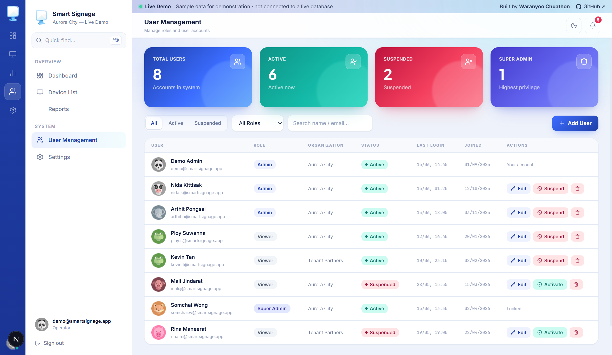

# Smart Signage Dashboard — Live Demo

**[English](README.md)** · ภาษาไทย

> ระบบ monitor สถานะจอ digital signage แบบ real-time — ออกแบบและพัฒนาเป็น dashboard สำหรับทีม operations
> **เวอร์ชันนี้คือ Live Demo** ใช้ข้อมูลตัวอย่างทั้งหมด ไม่เชื่อมต่อฐานข้อมูลจริง เปิดเล่นได้ทันทีโดยไม่ต้องล็อกอิน

🔗 **Live Demo:** https://signage-dashborad-status.vercel.app
🔑 **Demo login:** กดปุ่ม **"เข้าชม Live Demo"** หรือใช้ `demo@smartsignage.app` / `demo1234`
👤 **โดย:** Waranyoo Chuathon · [GitHub](https://github.com/WaranyooChuathon)
📐 **Architecture:** ดู [ARCHITECTURE.md](ARCHITECTURE.md)

---

## ภาพตัวอย่าง

รองรับธีม **มืด (dark)** และ **สว่าง (light)** ทั้งระบบ (สลับได้จาก topbar):

| 🌙 Dark | ☀️ Light |
|:--:|:--:|
|  |  |

| Login | Reports |
|:--:|:--:|
|  |  |
| **Device List + Side Panel** | **User Management** |
|  |  |

<details>
<summary>☀️ <b>ธีมสว่าง (Light mode)</b> — ทุกหน้า</summary>

<br>

| Login | Reports |
|:--:|:--:|
|  |  |
| **Device List + Side Panel** | **User Management** |
|  |  |

</details>

## ภาพรวม

Dashboard สำหรับติดตามสถานะเครือข่ายจอโฆษณาดิจิทัล (digital signage) หลายสิบจุดพร้อมกัน
แสดง online/offline แบบ real-time, แนวโน้มย้อนหลัง, สถิติ uptime รายเครื่อง และระบบจัดการผู้ใช้

## ฟีเจอร์หลัก

- **Dashboard** — KPI cards (online/offline/uptime rate), donut chart สรุปวันนี้, bar chart แนวโน้ม (วัน/สัปดาห์/เดือน/ปี), รายการอุปกรณ์ online/offline แบบ scroll + pagination
- **Device List** — ตารางอุปกรณ์ทั้งหมด ค้นหา/กรองตามสถานะ + side panel รายละเอียดรายเครื่อง
- **Reports** — กราฟ trend, อันดับ uptime % รายเครื่อง (sort สูง↔ต่ำ), ตารางสถิติ และ **Export CSV**
- **User Management** — เพิ่ม/แก้ไข/ระงับ/ลบผู้ใช้ พร้อม role (Super Admin / Admin / Viewer) และ generate รหัสผ่าน
- **Dark / Light mode** — สลับธีมได้ทั้งระบบผ่าน CSS variables
- **Responsive** — ปรับ layout ตั้งแต่จอใหญ่ถึงมือถือ

## Tech Stack

| ส่วน | เทคโนโลยี |
|------|-----------|
| Framework | Next.js 16 (App Router) + React 19 + TypeScript |
| Styling | CSS ล้วน (glassmorphism, deep navy) — ไม่ใช้ utility framework |
| Charts | SVG ที่เขียน arc/path math เอง (donut, trend, overlay) |
| Icons / Fonts | lucide-react · Inter / Plus Jakarta Sans / JetBrains Mono |
| Production data | Supabase (PostgreSQL + RPC functions) |
| Deploy | Vercel |

## สถาปัตยกรรมเรื่องข้อมูล (Production vs Demo)

โปรเจกต์จริงดึงข้อมูลจาก Supabase ผ่าน RPC (`get_online_summary`, `get_device_trend`,
`get_device_uptime`, `get_latest_status`) เวอร์ชัน demo นี้สลับชั้นข้อมูลออกมาเป็น **mock layer**
โดยไม่แตะ UI/logic ของหน้าใด ๆ เลย:

```
lib/mock/data.ts     → generate ข้อมูลตัวอย่าง deterministic (อุปกรณ์ 34 เครื่อง, trend, uptime, users)
lib/mock/client.ts   → mock client ที่มี interface เหมือน supabase-js (rpc / from / auth)
lib/supabase/*.ts    → คืน mock client แทน client จริง
```

ผลคือ demo build และรันได้โดย **ไม่ต้องมี environment variable หรือ secret ใด ๆ** และไม่มีการเชื่อมต่อฐานข้อมูลจริง

เอกสารออกแบบเต็ม: [ARCHITECTURE.md](ARCHITECTURE.md) · SQL: [schema.sql](supabase/schema.sql) · [functions.sql](supabase/functions.sql)

## รันบนเครื่อง (โหมด mock — ทันที)

```bash
npm install
npm run dev
# เปิด http://localhost:3000
```

ไม่ต้องตั้งค่า `.env` ใด ๆ — ทุกอย่างทำงานด้วยข้อมูลตัวอย่าง

## รันแบบต่อ Supabase จริง (โหมด full-stack)

แอปสลับไปใช้ backend จริงอัตโนมัติเมื่อมี Supabase env

1. สร้าง Supabase project ใหม่ (ของคุณเอง — ห้ามใช้ของบริษัท)
2. ใน SQL Editor รัน [supabase/schema.sql](supabase/schema.sql) แล้วตามด้วย [supabase/functions.sql](supabase/functions.sql)
3. สร้าง `.env.local`:
   ```
   NEXT_PUBLIC_SUPABASE_URL=https://xxxx.supabase.co
   NEXT_PUBLIC_SUPABASE_PUBLISHABLE_KEY=<anon key>
   SUPABASE_SERVICE_ROLE_KEY=<service_role key>
   ```
4. seed ข้อมูล + สร้าง demo user:
   ```bash
   npx tsx scripts/seed.ts
   npx tsx scripts/create-demo-user.ts
   ```
5. `npm run dev` → auth + RPC + Postgres จริง

## Deploy (Vercel)

1. push repo นี้ขึ้น GitHub ของคุณ
2. import เข้า [Vercel](https://vercel.com/new) → framework preset = Next.js
3. ใส่ env 3 ตัวด้านบนใน **Project Settings → Environment Variables**
4. ใน Supabase → **Authentication → URL Configuration** เพิ่ม domain ของ Vercel ใน allowed/redirect URLs
5. กด Deploy

> ไม่ใส่ env ก็ deploy ได้ (จะรันโหมด mock) · Supabase free tier จะ pause ตอนไม่ใช้งาน → first load อาจช้า

---

_เวอร์ชัน demo นี้ใช้ข้อมูลสมมติทั้งหมด สร้างขึ้นเพื่อแสดงผลงานเท่านั้น ไม่มีข้อมูลหรือการเชื่อมต่อกับระบบจริงขององค์กรใด_
